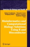
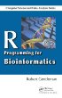
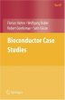

# Publications

<h2 name="featured">Featured</h2>

Lawrence M, Huber W, Pagès H, Aboyoun P, Carlson M, et al. (2013) <a
href="http://dx.doi.org/10.1371/journal.pcbi.1003118">Software for
Computing and Annotating Genomic Ranges</a>. PLoS Comput Biol 9(8):
e1003118. doi: 10.1371/journal.pcbi.1003118

Lawrence, M, and Morgan, M. (2014) <a
href="http://arxiv.org/abs/1409.2864">Scalable Genomics with R
and Bioconductor</a> Statistical Science, Vol. 29, No. 2, 214-226
10.1214/14-STS476

<h2 name="recent">Recent</h2>

20 most recent PubMed Central citations mentioning &quot;*Bioconductor*&quot;.
For a complete list, go to <a href="http://www.ncbi.nlm.nih.gov/pmc/?term=bioconductor" target="_blank">PubMed Central</a>. Last updated 
<abbr class="timeago" title="<%=get_pubmed_cache_date()%>"><%=get_pubmed_cache_date()%></abbr>.

<%= render('/_pubmed/', :pb_item => find_item(@items, '/help/publications/papers/pubmed/')) %>

## Books

&nbsp;&nbsp;&nbsp;&nbsp;
&nbsp;&nbsp;&nbsp;&nbsp;

## Book Chapters
* [Analyzing biological data using R: methods for graphs and networks.](book-chapters/MiMB)

## Technical Reports and Working Papers

* [Technical Reports](tech-reports/)
* [Working Papers](http://www.bepress.com/bioconductor/) ([Instructions for Authors](http://www.bepress.com/bioconductor/authors.instructions.html))

## Compendia

* [GeneMetaEx](compendia/genemetaex/)
* [GolubRR](compendia/golubrr/)
* [CompStatViz](compendia/CompStatViz/)

