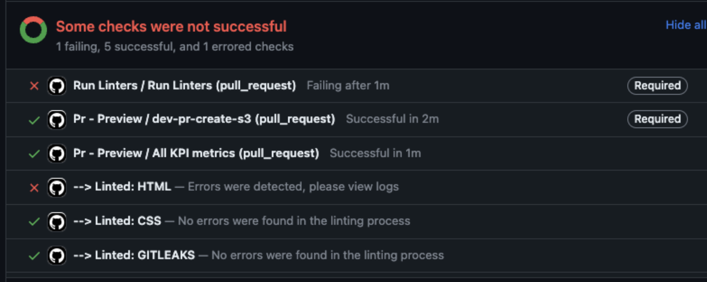
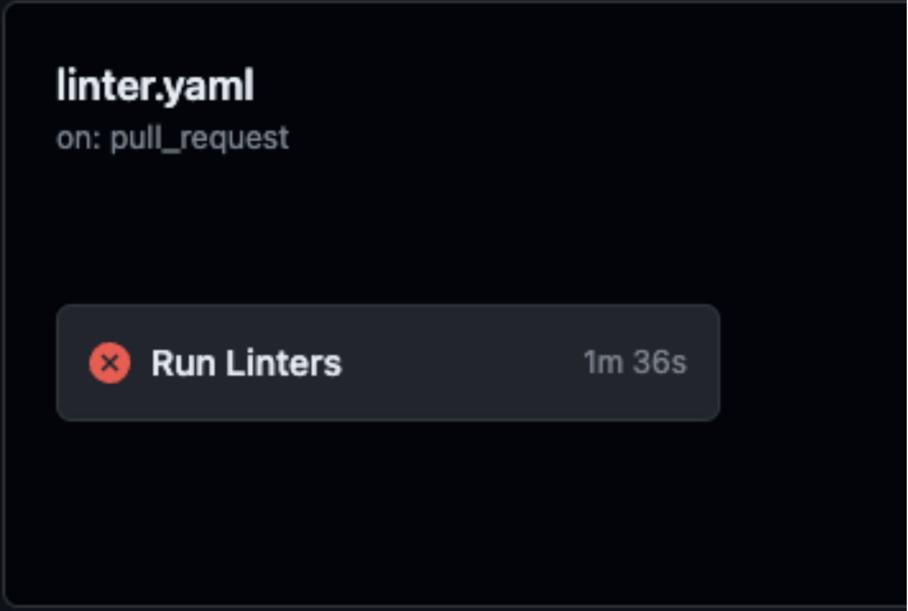
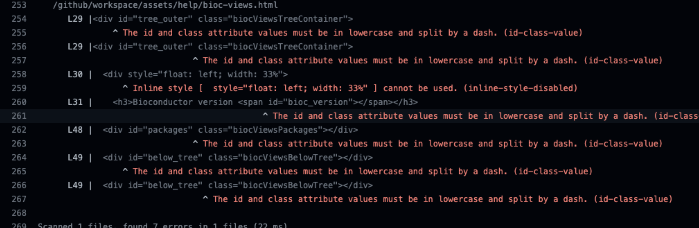

# Linting

In order to help with consistency of the code within the project linting has been implemented. The implementation consists of two parts, firstly the ability to lint across all files locally, and secondly to lint across only changes using GitHub Actions.

## Linting Locally

In order to lint locally you will require NodeJS installed. This can either be done by installing [NodeJS directly](https://nodejs.org/en) or by using a pacakage such as [Node Version Manager](https://github.com/nvm-sh/nvm). In order to install and run the linting we recommend using at least NodeJS version 18.

Once NodeJS is installed you can lint by first installing dependencies:

```sh
npm ci
```

Once the dependencies are installed then you can run the linters by running:

```sh
npm run lint
```

This will run linting for HTML, CSS, JavaScript, and Markdown. You can also run linters for each of these individually:

```sh
npm run lint-html
npm run lint-css
npm run lint-js
npm run lint-md
```

The output of these will display any places where the current files do not match the linting rules.

## Linting using GitHub Actions

These checks will run without any further configuration and will check the CSS, HTML, and JavaScript of files which have been changed.

### Output

If the linter is successful it will appear as “Run Linters / Run Linters (pull_request)” with a green checkmark on the Pull Request within GitHub. If there are any linting error then they will appear with a red cross next to them, as in the below image:



To review the linting errors:

* Click on "Details" by the failing linter.
* Click on "Run Linters" on the following screen.

* Locate the red text within the next screen


This will show the file with the issue, in the above case assets/help/bioc-views.html, and the lines and issues within those lines, for example L29 in the above refers to line 29 of the file being scanned.


### Enforcing Linting

The default behaviour is for the linting checks to act as informational only, however you can set them to be blocking which would require any linting issues to be resolved before the changes could be accepted.

To set the linting checks to require correct passing before allowing changes to be accepted:

* Go to the Repository settings
* Go to the Branches settings
* Add or Edit the branch you want to check PRs against
* Check "Require status checks to pass before merging"
* Enter "Run Linters" into the search box and select the resulting option
* Confirm "Run Linters" is shown under the "Status checks that are required."
* Press "Save Changes"

Future pull requests will now require the linters action to successfully complete before allowing the pull request to be merged.
