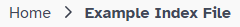
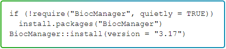
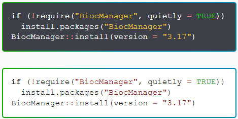
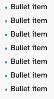
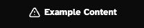
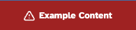
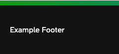
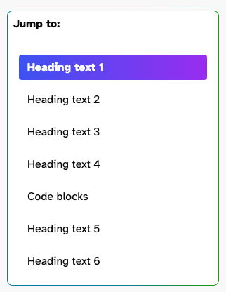

# Styling

The styling for bioconductor.org is built to be reused in other places. It comprises of several different aspects

* [Base styling](#base-styling)
    * [Fonts](#fonts)
    * [Colors](#colors)
    * [Typography](#typography)
    * [Layout](#layout)

* [Component styling](#component-styling)
    * [Block Quotes](#block-quotes)
    * [Breadcrumbs](#breadcrumbs)
    * [Code Blocks](#code-blocks)
      * [Default Usage](#default-usage)
      * [Light Theme](#light-theme-variation)
      * [Code Highlighting](#code-highlighting)
    * [Gallery](#gallery)
* [Lists](#lists)

* [Section styling](#section-styling)
    * [Announcement](#announcement)
    * [Footer](#footer)
    * [Header](#header)
    * [Sidebar](#sidebar)

* [Page styling](#page-styling)
    * [About](#about)
    * [Get Started](#get-started)
    * [Home](#home)
    * [Learn and Developers](#learn-and-developers)


## Base styling

The base styles comprise of [fonts](#fonts), [colors](#colors) and [typography](#typography) and can be easily reused across different websites. In addition there is the [layout](#layout) styling which helps to set the structure of the page. All other styling options rely on these being in place.

All of the base styling can be found in [assets/style/base/](/assets/style/base/)

### Fonts

These set the default font for the entire site. The default font is [Atkinson Hyperlegible](https://fonts.google.com/specimen/Atkinson+Hyperlegible). The font file is hosted locally on the website due to some [GDPR concerns relating to Google Fonts](https://www.cookieyes.com/documentation/features/google-fonts-and-gdpr/#How_do_Goo_0).

In order to use the fonts simply include the font CSS sheet in your web page.

```html
<link rel="stylesheet" href="/style/fonts.css" />
```

You will also need to include the font files. These can be found in [assets/style/fonts/](/assets/style/fonts/). 


### Colors

The colors used across the site are defined in the colors CSS file. These are as defined in the style guide. Other components used throughout the css will rely on these colors being in place and won't work without them.

In order to use the colours include the colour CSS sheet in your web page.

```html
<link rel="stylesheet" href="/style/base/colors.css" />
```


### Typography

There are multiple differences throughout the styles for Bioconductor from the default typography in browsers. These affect elements such as headings (H1, H2, H3, H4, H5, H6), paragraphs, links, and provide some utility classes.

In order to use these include the typography CSS sheet in your web page.

```html
<link rel="stylesheet" href="/styles/base/typography.css" />
```

### Layout

The layout of the site is set to be a fixed width on screens wider than 1400px, and scale down on screens that are smaller. This is set in the [layout.css](/assets/style/base/layout.css) file.

In order to apply this layout you will need to firstly include the layout CSS.

```html
<link rel="stylesheet" href="/styles/base/layout.css />
```

To apply the layout constraints there is a utility class called `container`. Applying this class is done as in the following example.

```html
<div class="container">
    ...content
</div>
```

## Component styling

Components are styled up in their own stylesheets, and examples of them can be seen on the [examples](/content/examples) pages. In order to use the components you will need to apply the Fonts, Colors and Typography stylesheets. The following components have been set up:

* [Block quotes](#block-quotes)
* [Breadcrumbs](#breadcrumbs)
* [Code blocks](#code-blocks)
  * [Default Usage](#default-usage)
  * [Light Theme](#light-theme-variation)
  * [Code Highlighting](#code-highlighting)
* [Gallery](#gallery)
* [Lists](#lists)

All of the base styling can be found in [assets/style/components/](/assets/style/components/)

### Block quotes

Block quotes are a way of highlighting different pieces of text. The styling for the block quotes is available in [blockquote.css](/assets/style/components/blockquote.css)

Prerequisites:

* [colors.css](#colors)
* [fonts.css](#fonts)
* [typography.css](#typography)

Usage:

```html
<link rel="stylesheet" href="/styles/components/blockquote.css" />

<blockquote>Some text to highlight</blockquote>
```

Example output:


### Breadcrumbs

Breadcrumbs are used to denote where the user is within the site hierarchy. Items further up the hierarchy of pages are clickable by the user in order to navigate to those pages. Styling for the breadcrumbs is available in [breadcrumbs.css](/assets/style/components/breadcrumbs.css)

In addition to the CSS you will also need the chevron image found at [/assets/images/icons/svgs/chevron-right-n400.svg](/assets/images/icons/svgs/chevron-right-n400.svg)

Prerequisites:

* [colors.css](#colors)
* [fonts.css](#fonts)

Usage:

```html
<link rel="stylesheet" href="/styles/components/breadcrumbs.css" />

<ul class="breadcrumbs">
    <li><a href="/">Homepage</a></li>
    <li>Current Page</li>
</ul>
```

Example output:



### Code blocks

In order to display example code you should use the `pre` and `code` blocks. Styling for code blocks are available in [code.css](/assets/style/components/code.css)

Prerequisites:

* [colors.css](#colors)

##### Default Usage

Usage:

```html
<link rel="stylesheet" href="/styles/components/code.css" />

<pre><code>Display some code here</code></pre>
```

Example output:


##### Light Theme Variation

Usage:

```html
<link rel="stylesheet" href="/style/components/code.css" />

<pre><code class="light">Display some code here</code></pre>
```

Example output:



##### Code Highlighting

In order to add the highlighting effect for the code you will need to add [highlight.js](https://highlight.js), an additional javascript file, and set the language in the class. The full list of languages supported can be found [here](https://highlightjs.readthedocs.io/en/latest/supported-languages.html).

Usage:

```html
<link rel="stylesheet" href="/style/components/code.css" />
<script src="//cdnjs.cloudflare.com/ajax/libs/highlight.js/11.7.0/highlight.min.js"></script>

<pre><code class="language-r">Some code here</code></pre>
```

Exmaple output:



### Gallery

The gallery component is used to create a set of dynamically sizing tiles, for example when displaying images or information about people. The styling is available in [gallery.css](/assets/style/components/gallery.css)

Prerequisites:

* [Fonts](#fonts)
* [Typography](#typography)

Usage:

```html
<link rel="stylesheet" href="/style/components/gallery.css" />

<div class="gallery">
  <div class="gallery-card">
    
    <a href="#">Name (With link)</a>, Organisation, Title
  </div>
  <div class="gallery-card">
    
    <a href="#">Name (With link)</a>, Organisation, Title
  </div>
  <div class="gallery-card">
    
    <a href="#">Name (With link)</a>, Organisation, Title
  </div>
  <div class="gallery-card">
    
    <a href="#">Name (With link)</a>, Organisation, Title
  </div>
  <div class="gallery-card">
    
    <a href="#">Name (With link)</a>, Organisation, Title
  </div>
  <div class="gallery-card">
    
    <a href="#">Name (With link)</a>, Organisation, Title
  </div>
  <div class="gallery-card">
    
    <a href="#">Name (With link)</a>, Organisation, Title
  </div>
  <div class="gallery-card">
    
    <a href="#">Name (With link)</a>, Organisation, Title
  </div>
  <div class="gallery-card">
    
    <a href="#">Name (With link)</a>, Organisation, Title
  </div>
</div>
```

Example output:


### Lists

Lists are used to display a list of related information. The styling currently only applies to Unordered Lists (UL), and can be found in [lists.css](/assets/style/components/lists.css)

Prerequisites:

* [Fonts](#fonts)

Usage:

```html
<link rel="stylesheet" href="/style/components/lists.css" />

<ul>
    <li>First list item</li>
    <li>Second list item</li>
</ul>
```

Example output:



## Section styling

Different sections of the page may also have specific styling. These are less likely to be reused in other places. The following sections have specific styling associated with them:

* [Announcement](#announcement)
* [Footer](#footer)
* [Header](#header)
* [Sidebar](#sidebar)

All of the section styling can be found in [assets/style/sections/](/assets/style/sections/)

### Announcement

The announcement section is used to display important information to the user when they join. Styling for this can be found in [announcement.css](/assets/style/sections/announcement.css)

Prerequisites:

* [Colors](#colors)
* [Fonts](#fonts)
* [Typography](#typography)

#### Default

Usage:

```html
<link rel="stylesheet" href="/style/sections/announcement.css" />

<div class="announcement">
    <svg xmlns="http://www.w3.org/2000/svg" width="19" height="18" viewBox="0 0 19 18" fill="none">
      <path d="M9.50003 6.75V8.25M9.50003 11.25H9.50753M4.30387 14.25H14.6962C15.8509 14.25 16.5726 13 15.9952 12L10.7991 3C10.2217 2 8.77834 2 8.20099 3L3.00484 12C2.42749 13 3.14917 14.25 4.30387 14.25Z" stroke-width="1.5" stroke-linecap="round" stroke-linejoin="round"></path>
    </svg>

    <p>Example Content</p>
</div>
```

Example Output:




#### Branded Variation

Usage:

```html
<link rel="stylesheet" href="/style/sections/announcement.css" />

<div class="announcement announcement-brand">
  <svg xmlns="http://www.w3.org/2000/svg" width="19" height="18" viewBox="0 0 19 18" fill="none">
    <path d="M9.50003 6.75V8.25M9.50003 11.25H9.50753M4.30387 14.25H14.6962C15.8509 14.25 16.5726 13 15.9952 12L10.7991 3C10.2217 2 8.77834 2 8.20099 3L3.00484 12C2.42749 13 3.14917 14.25 4.30387 14.25Z" stroke-width="1.5" stroke-linecap="round" stroke-linejoin="round"></path>
  </svg>

  <p>Example Content</p>
</div>
```

Example Output:


#### Alert Variation

Usage:

```html
<link rel="stylesheet" href="/style/sections/announcement.css" />

<div class="announcement announcement-error">
  <svg xmlns="http://www.w3.org/2000/svg" width="19" height="18" viewBox="0 0 19 18" fill="none">
    <path d="M9.50003 6.75V8.25M9.50003 11.25H9.50753M4.30387 14.25H14.6962C15.8509 14.25 16.5726 13 15.9952 12L10.7991 3C10.2217 2 8.77834 2 8.20099 3L3.00484 12C2.42749 13 3.14917 14.25 4.30387 14.25Z" stroke-width="1.5" stroke-linecap="round" stroke-linejoin="round"></path>
  </svg>

  <p>Example Content</p>
</div>
```

Example Output:



#### Warning Variation

Usage:

```html
<link rel="stylesheet" href="/style/sections/announcement.css" />

<div class="announcement announcement-warning">
  <svg xmlns="http://www.w3.org/2000/svg" width="19" height="18" viewBox="0 0 19 18" fill="none">
    <path d="M9.50003 6.75V8.25M9.50003 11.25H9.50753M4.30387 14.25H14.6962C15.8509 14.25 16.5726 13 15.9952 12L10.7991 3C10.2217 2 8.77834 2 8.20099 3L3.00484 12C2.42749 13 3.14917 14.25 4.30387 14.25Z" stroke-width="1.5" stroke-linecap="round" stroke-linejoin="round"></path>
  </svg>

  <p>Example Content</p>
</div>
```

Example Output:


### Footer

This displays the footer on the page. The styling for this can be located in [footer.css](/assets/style/sections/footer.css)

Prerequisites:

* [Colors](#colors)
* [Fonts](#fonts)
* [Typography](#typography)

Usage:

```html
<link rel="stylesheet" href="/style/sections/footer.css" />

<footer>
    <div class="footer-container">
        ... Footer content
    </div>
</footer>
```

The footer used on bioconductor.org can be found at [layouts/components/footer.html](/layouts/components/footer.html)

Example Output:



### Header

The header contains the top navigation bar of the site. The styling can be found in [header.css](/assets/style/sectons/header.css)

Prerequisites:

* [Colors](#colors)
* [Fonts](#fonts)
* [Typography](#typography)
* [Layout](#layout)

Usage:

```html
<header id="site-masthead" class="site-masthead">
  <div class="header-size">
    <div class="header-logo">
      <a href="/">
        
      </a>
    </div>

    <nav class="header-nav">
      <div class="nav-links">
        <a class="format-bold mobile-link" href="/about/">About</a>
        <a class="format-bold mobile-link" href="/developers/">Developers</a>
        <a class="format-bold mobile-link" href="/help/">Learn</a>
      </div>
      <div class="search-container">
        <form class="site-search" id="search-form" method="GET" action="/help/search/index.html">
          <label for="search-bar" class="sr-only">Search</label>
          
          <input class="search-bar" name="search-bar" placeholder="Search" id="search-bar">
        </form>
      </div>

      <a class="header-button format-bold mobile-link" href="/install/">
        <span class="get-started format-bold">
          Get Started
          <svg xmlns="http://www.w3.org/2000/svg" width="14" height="15" viewBox="0 0 14 15" fill="none">
            <path d="M5.25 3.66665L9.33333 7.74998L5.25 11.8333" stroke="#3792AD" stroke-width="2.2" stroke-linecap="round" stroke-linejoin="round"></path>
          </svg>
        </span>
      </a>
    </nav>

    <div class="nav-mobile">
      <h6>Menu</h6>
      <div class="hamburger">
        <span class="bar"></span>
        <span class="bar"></span>
        <span class="bar"></span>
      </div>
    </div>
  </div>
</header>
```

The header used on bioconductor.org can be found at [layouts/components/header.html](/layouts/components/header.html)

Example Output:


### Sidebar

The sidebar of the site is for section navigation or in-page navigation. Styling for these can be found at [layouts/components/sidebar.css](/layouts/components/sidebar.css).

Prerequisites:

* [Colors](#colors)
* [Fonts](#fonts)
* [Typography](#typography)
* [Layout](#layout)

Usage:

```html
<link rel="stylesheet" href="/layouts/components/sidebar.css" />

<div class="container main-subnav">
    <section class="left-col">
        Sidebar content
    </section>
    <section class="content">
        Main content
    </section>
</div>
```

In-page navigation:

```html
<link rel="stylesheet" href="/layouts/components/sidebar.css" />

<div class="container main-subnav">
    <section class="left-col">
        <div class="sidebar-nav">
            <span class="sidebar-header">
              <p class="format-bold">Jump to:</p>
              
            </span>

            <nav class="internal-nav" aria-label="Page navigation">
              <a class="sidebar-nav-button selected-nav" href="#heading-text-1">Heading text 1</a>
              <a class="sidebar-nav-button" href="#heading-text-2">Heading text 2</a>
              <a class="sidebar-nav-button" href="#heading-text-3">Heading text 3</a>
              <a class="sidebar-nav-button" href="#heading-text-4">Heading text 4</a>
              <a class="sidebar-nav-button" href="#code-blocks">Code blocks</a>
              <a class="sidebar-nav-button" href="#heading-text-5">Heading text 5</a>
              <a class="sidebar-nav-button" href="#heading-text-6">Heading text 6</a>
            </nav>
        </div>
    </section>
    <section class="content">
        Main content
    </section>
</div>
```

Example output:

Full examples can be found in the [examples](/layouts/examples/) folder



## Page styling

As part of the new styling for bioconductor.org some pages also require specific styling applied. These are not likely to be reused. The following pages have specific styles attached:

* [About](#about)
* [Get Started](#get-started)
* [Home](#home)
* [Learn and Developers](#learn-and-developers)

All the stylings for specific pages can be found in [assets/style/pages/](/assets/style/pages/)

### About

The styling for the about page is available in [assets/style/pages/about.css](/assets/style/pages/about.css)

### Get Started

The styling for the Get Started page is available in [assets/style/pages/get-started.css](/assets/style/pages/get-started.css)

### Home

The styling for the home page is available in [assets/style/pages/home.css](/assets/style/pages/home.css)

### Learn and Developers

The learn and developers pages use the same styling. This is available in [assets/style/pages/learn-and-dev.css](/assets/style/pages/learn-and-dev.css)
